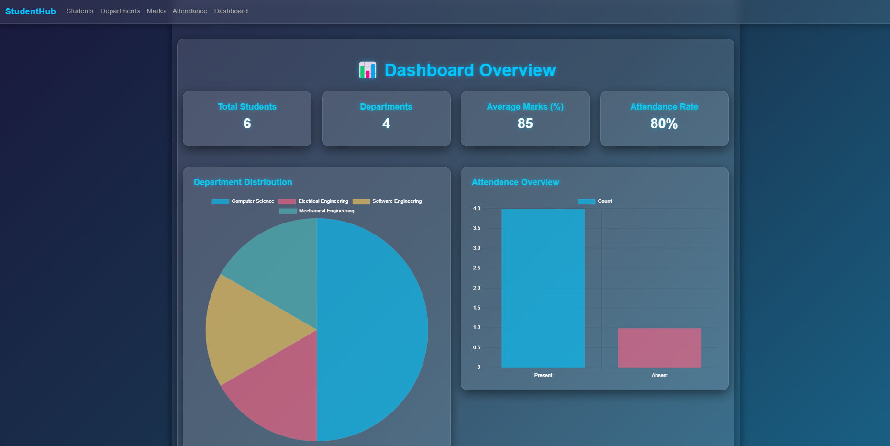
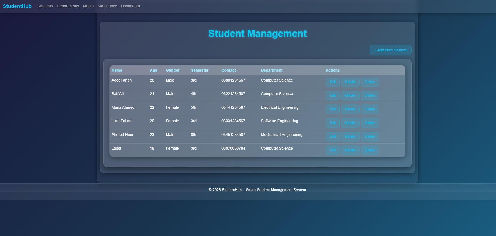
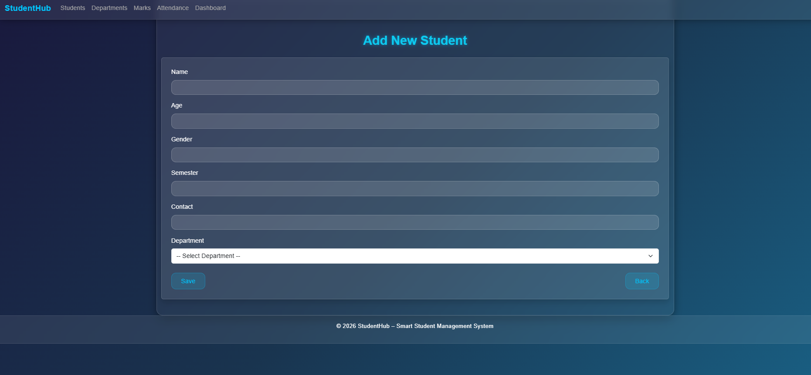

# StudentHub

A web-based ASP.NET MVC project for managing students, departments, attendance, and marks.

## Features
- Student Management
- Attendance Tracking
- Marks Management
- Department Handling

## Tech Stack
- ASP.NET MVC
- SQL Server
- Bootstrap

## Setup Instructions
1. Clone the repository
2. Open in Visual Studio
3. Run the SQL file: studenthub_db.sql
4. Run the project

## Database
Included: studenthub_db.sql

## 🖼️ Screenshots

### Dashboard

### Students List

### Add Student
